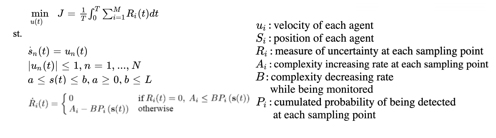
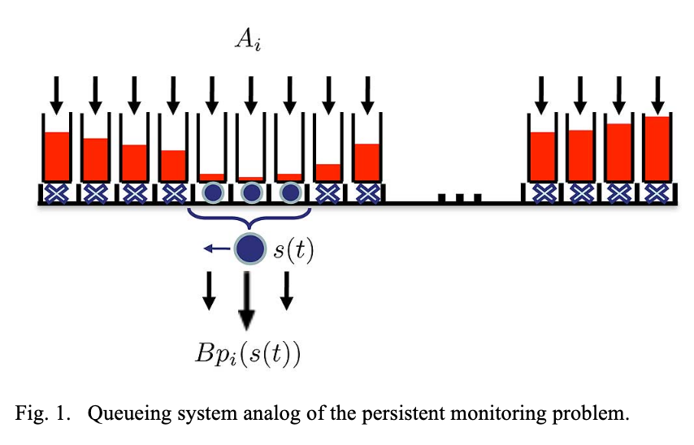
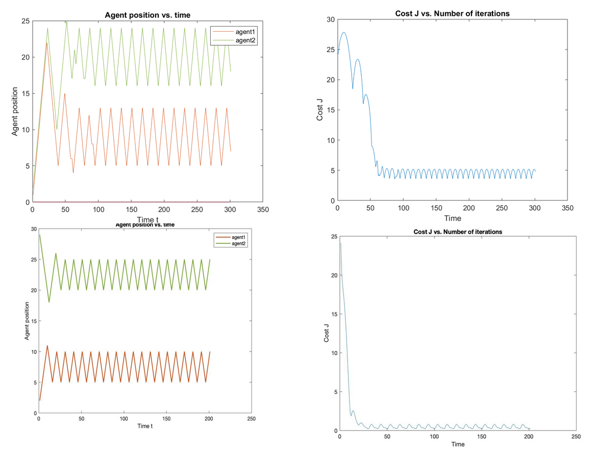
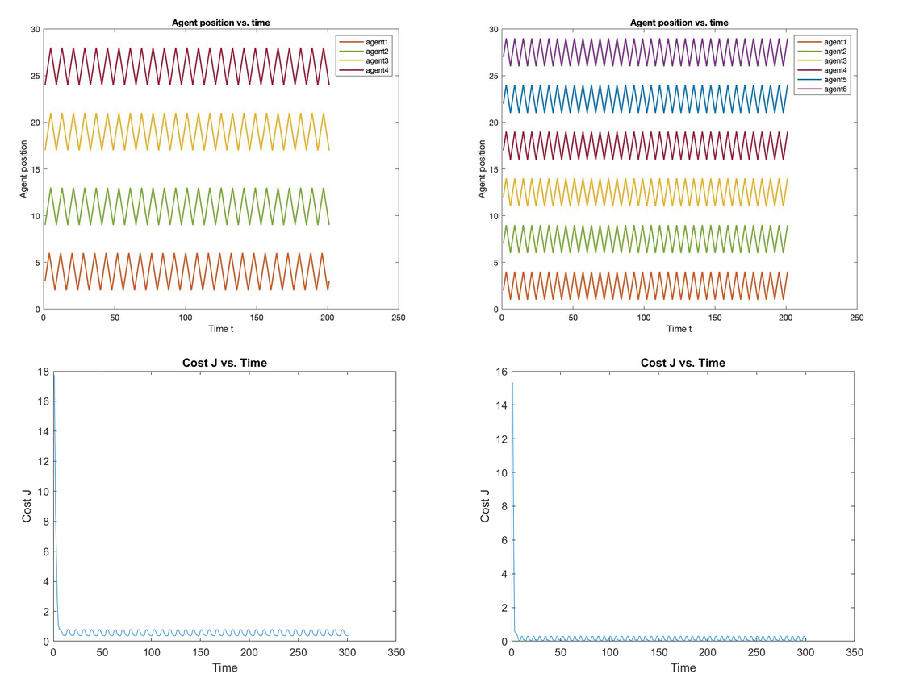
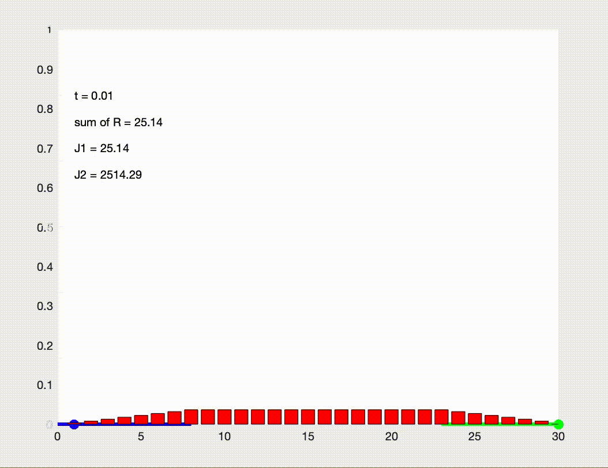

# SE 701 Term Project
**An Optimal Control Approach to the Multi-Agent Persistent Monitoring Problem**

## Background 
From the introduction of concepts to the appearance of solid robots, robot technology has always been a hot research topic and an important development trend of future science and technology. Nowadays, robot technology is widely used in storage, logistics, industrial automation, military and many other fields. In order to accomplish a certain task in these fields, especially to solve some special tasks with distributed space or time, the robot system must have high efficiency and stability. It is obviously unwise to combine the complex function configuration with a robot, so the multi robot system becomes the research core. In short, it is to cooperate with multiple robots to complete a series of efficient tasks.

Robot cooperation scenarios could be divided into two categories: static environment and dynamic environment. The persistent monitoring problem arises in a dynamic scenario, in which cooperating mobile agents must monitor the dynamic changing environment. The paper [1] that we researched for this project aimed at providing an optimal control solution to the persistent monitoring problem in 1-D space through minimizing a metric of uncertainty over the environment.

To simulate the persistent monitoring problem, two crucial aspects are necessary for consideration: how to simplify the environment model due to limited computational capability as well as how to present the complexity of a dynamic environment. For the first aspect, instead of monitoring all discrete points within the environment, sampling points were assigned, and those points would be monitored persistently. And the monitoring process of each individual point could be metaphorized as enqueuing and dequeuing in a “uncertainty queue”. For the second aspect, the complexity of each individual sampling point was presented by a function of space and time. Also, intuitively, such complexity would be inversely proportional to the event detection probability.

## Problem Description

## Method

In the theory of optimal control, we use Pontryagin's maximum principle to find the best possible control to transfer a dynamic system from one state to another, especially when there are state or input control constraints. It points out that any optimal control and optimal state trajectory must solve the Hamiltonian system, which is a two-point boundary value problem, plus a maximum condition of Hamiltonian. Under some convexity conditions of objective function and constraint function, these necessary conditions are sufficient.

Perturbation analysis is a technique to accelerate the experimental process of discrete event simulation models. This makes it possible to derive sensitivity estimates from a computer performing a simulation model. Infinitesimal perturbation analysis (IPA) is a kind of algorithm in perturbation analysis. In this paper, the technology and algorithm of infinitesimal disturbance analysis in simulation are studied. In this paper, various algorithms are discussed in detail, and the implementation problems are discussed. Finally, the experimental results of the serial transmission line are given. The results of this paper show that IPA can be easily implemented with Siman and other general simulation languages for a simple system. Unfortunately, for any given system, parameter, or performance metric, the algorithms used to generate gradients may differ. In addition, there is no algorithm for more complex problems. This problem hinders the possibility of integrating IPA into general simulation language.

## Result

### Optimized path and corresponding cost for system with two agents

### Optimized path and corresponding cost for system with multiple agents

## Reference

[1] C. G. Cassandras, X. Lin and X. Ding, "An Optimal Control Approach to the Multi-Agent Persistent Monitoring Problem," in IEEE Transactions on Automatic Control, vol. 58, no. 4, pp. 947-961, April 2013.

## Simulation

